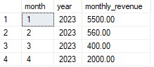

# DSA2040-GROUP2-LAB-1

## Retail Data Warehouse
This project builds a mini data warehouse for a fictional retail company to analyze sales performance by product, store, and time.

## Contents
- `schema.sql`: Table creation scripts
- `load_data.sql`: SQL commands to load data from CSVs
- `queries.sql`: Sample analytical queries
- `*.csv`: Dimension and fact data

## How to use 
1. Set up a MicrosoftSQL database
2. Run `schema.sql` to create the schema
3. Load CSV data using `load_data.sql`
4. Run queries from `queries.sql` to analyze

## Overview
- Through Microsoft SQL, the database Retail Data Warehouse was created. We ran the `schema.sql` and created the 4 different tables; dim_date,dim_product,dim_store and fact_sales.
- Looking through the tables, there was no data inputted. We created a new query `import files.sql`under the database and loaded the CSV files of each table.
- We loaded the data successfully  and use `queries.sql` to run different analytical queries. The queries executed successfully.
  
   1. Total Revenue by Product category 
   

   2. Monthly Sales Trends 
   

   3. Revenue by Region 
   

   4. Top Products by Quantity Sold 

- We did the reflection and discussions on an rmd file `QUESTION 5.Rmd`.
- We used the Github in visual studio to push the files.

## Team members
- Mitchel Makena- 667413(@MMMakena)
- Esther Wambui - 669399(@Esther-Wambui)
- Kyra Joy Kariuki - 669619(@Kyrajwk)
- Queen Kibegi -668897(@QUEEN-KIBEGI)
- Claire Mwarari -669470(@dollykoi)

# License
MIT License
